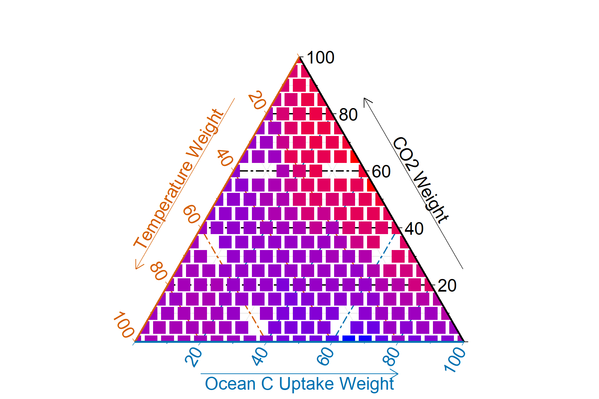
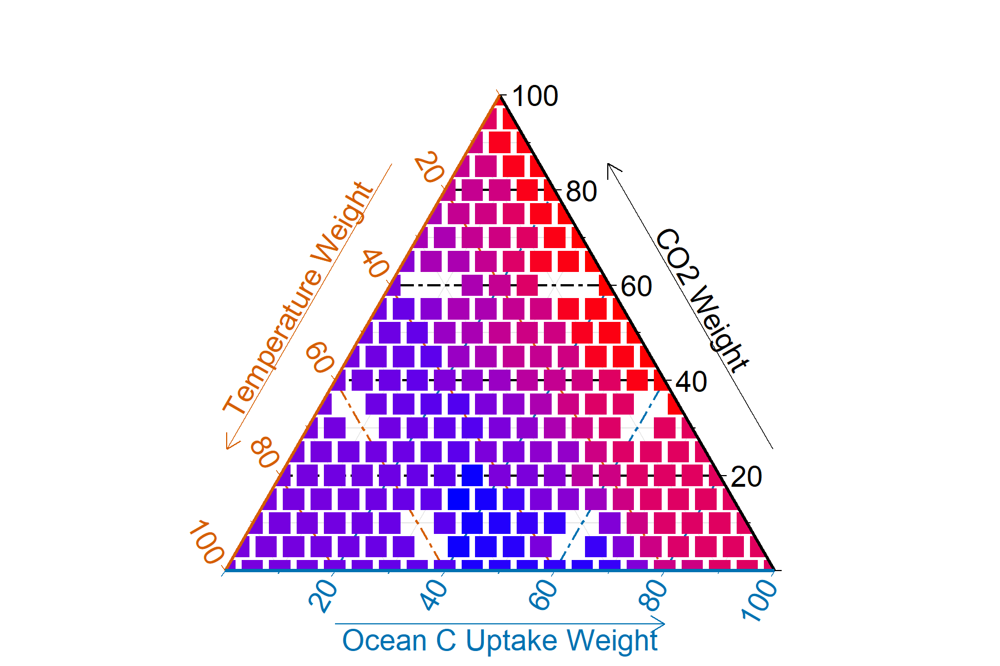

#

```{r setup, include=FALSE}
library(knitr)
library(kableExtra)
```

```{r}
# # Create the data frame
# table1 <- data.frame(
#   Scenario = c("SSP1-1.9"),
#   Lower = c("workflows/figures/SSP1-1.9_short_lower_error.png"),
#   Median = c("workflows/figures/SSP1-1.9_short_median_error.png"),
#   Upper = c("workflows/figures/SSP1-1.9_short_upper_error.png")
# )
# 
# # Display Table 1
# kable(table1, escape = FALSE, col.names = c("SSP Scenario", "Lower", "Median", "Upper")) %>%
#   kableExtra::kable_styling("striped", full_width = F) %>%
#   column_spec(2, image = spec_image(table1$Lower, width = "100px", height = "auto")) %>%
#   column_spec(3, image = spec_image(table1$Median, width = "100px", height = "auto")) %>%
#   column_spec(4, image = spec_image(table1$Upper, width = "100px", height = "auto"))
```

```{r}
# Load necessary libraries
# Load necessary libraries
library(knitr)
library(kableExtra)

# Create the data frame with image markdown
table1 <- data.frame(
  Scenario = c("SSP1-1.9"),
  Lower = c('{width=300px height=200px}'),
  Median = c('{width=300px height=200px}'),
  Upper = c('{width=300px height=200px}')
)

# Create the table with consistent width settings
kable(table1, escape = FALSE, align = "c") %>%
  kable_styling(full_width = FALSE) %>%
  column_spec(1, width = "3cm", extra_css = "vertical-align: middle;") %>%  # Scenario column
  column_spec(2, width = "7cm", extra_css = "vertical-align: middle;") %>%  # Lower column
  column_spec(3, width = "7cm", extra_css = "vertical-align: middle;") %>%  # Median column
  column_spec(4, width = "7cm", extra_css = "vertical-align: middle;")      # Upper column

```

